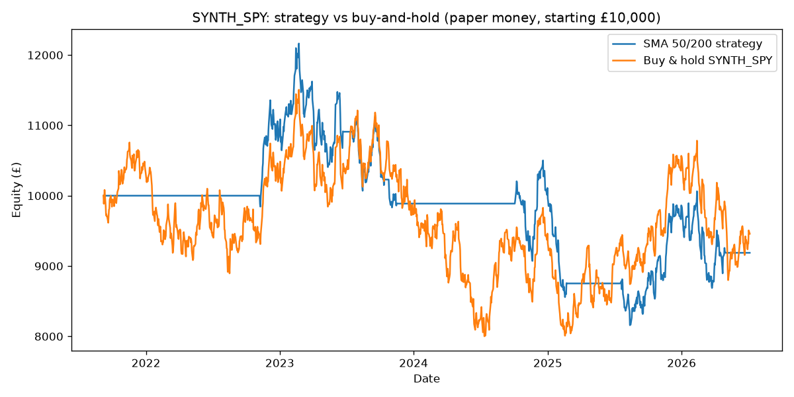

# ⚠️ SYNTHETIC TEST DATA — NOT A REAL BACKTEST

This run used randomly generated price data to verify the backtest engine's math and reporting work correctly. It says nothing about how this strategy would perform on real markets. Run `fetch_data.py` with real Alpaca market data and re-run this backtest before drawing any conclusion about the strategy.

# Backtest Report: SYNTH_SPY

Period: 2021-09-07 to 2026-07-06 (4.8 years)
Starting paper capital: £10,000
Assumed transaction cost: 5 bps per position change
Number of trades (position changes): 10

| Metric | SMA 50/200 Strategy | Buy & Hold |
|---|---|---|
| Total return | -8.1% | -5.4% |
| CAGR | -1.7% | -1.1% |
| Max drawdown | -32.9% | -30.5% |
| Sharpe ratio (annualised) | -0.08 | 0.03 |

## Verdict

The strategy did **not** beat buy-and-hold on total return (-8.1% vs -5.4%) over this period. This is the normal outcome for trend-following strategies during periods without a sustained downtrend to sit out — the historical base rate for this kind of strategy beating a simple index hold is low. That's real information, not a bug.

It did not meaningfully reduce drawdown either, in this run.

Past performance (real or synthetic) is not evidence of future results. This report is a decision input, not a guarantee — see `../OPERATIONS.md` and the top-level constraint: this project stays paper money only.